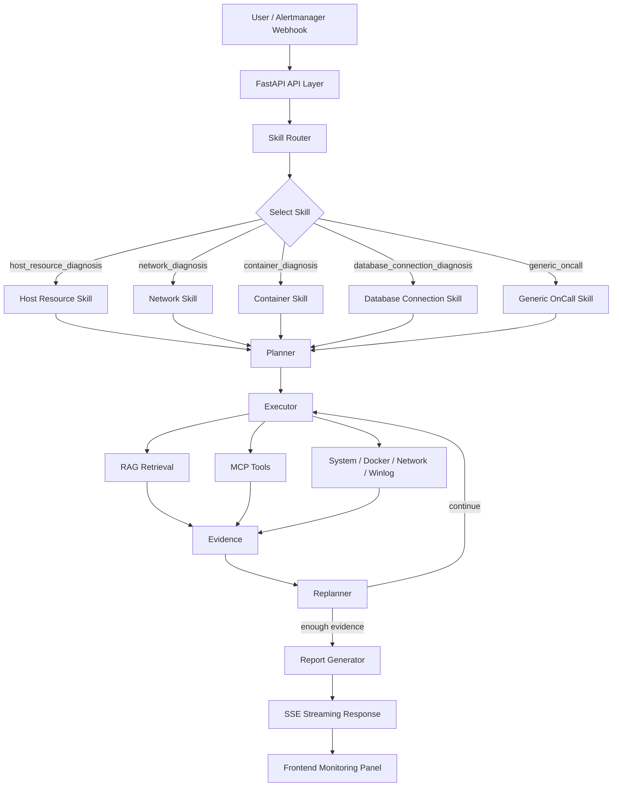

# MultiAgent AIOps

面向 OnCall / SRE 场景的多智能体智能运维诊断平台。系统围绕告警、故障现象和运维问答构建，支持 Skill 路由、诊断计划生成、只读工具调用、RAG 知识库检索、SSE 流式过程展示和 Markdown 诊断报告输出。

项目基于 `FastAPI`、`LangGraph`、`LangChain`、`Milvus`、`Redis`、`MCP / FastMCP`、DashScope/Qwen 兼容模型以及可选 DeepSeek / 本地 OpenAI-style LLM 运行。


## 核心能力

- **Skill-first 诊断流程**：先由 Skill Router 判断故障类型，再让 Planner 基于对应 Playbook 生成诊断计划，减少无关 SOP 和工具列表进入上下文。
- **Plan-Execute-Replan 闭环**：通过 `SkillRouter -> Planner -> Executor -> Replanner -> Report` 的 LangGraph 流程执行诊断，支持证据不足时继续收集或调整计划。
- **运行时控制面**：`app/runtime/agent_harness.py` 统一管理 prompt、模型选择、重路由限制、Replanner 快路径、统计事件、预算告警和降级文本。
- **RAG 知识库**：使用 DashScope Embedding + Milvus，支持内置 OnCall SOP 与 Prometheus 告警语料检索。
- **Hybrid Search + Rerank**：支持 BM25 + Vector 融合召回，并可通过 DashScope `gte-rerank-v2` 做精排；组件不可用时自动降级。
- **MCP 工具服务**：接入本机系统、联网搜索、Windows 事件日志、网络诊断和 Docker 只读诊断工具。
- **工具权限边界**：通过 Skill 白名单、工具风险元数据和 `PERMISSION_MODE` 控制工具调用；`docker_restart` 等高风险操作默认禁用。
- **并行只读工具调用**：对互不依赖且标记为安全的只读工具进行批量并发执行，降低多工具诊断等待时间。
- **RAG Chat + 会话记忆**：提供独立知识库问答接口，可选 Redis 会话记忆、多轮问题改写、摘要压缩、MCP 工具增强和受控联网搜索。
- **SSE 可观测输出**：前端可实时展示 Skill 选择、计划、步骤、工具调用、token/耗时统计、预算提示和最终报告。
- **本地 LLM 兜底**：支持在主模型不可达或开发调试时切换到本地 OpenAI 兼容服务，例如 Ollama。

## 当前 Skill

| Skill | 适用场景 | 风险级别 |
|---|---|---|
| `host_resource_diagnosis` | 本机 CPU、内存、磁盘、进程和 Windows 日志排查 | low |
| `network_diagnosis` | DNS、Ping、HTTP、端口连通性和网络超时排查 | low |
| `container_diagnosis` | Docker 容器状态、资源、日志、inspect 诊断 | medium |
| `database_connection_diagnosis` | MySQL、PostgreSQL、Redis 等数据库连接超时、拒绝、DNS/端口问题 | low |
| `generic_oncall` | 通用 OnCall 排障兜底路径 | low |

## 架构概览



核心链路仍然是 Skill-first 的诊断闭环：

1. 用户输入故障描述，或 Alertmanager Webhook 推送告警。
2. Skill Router 选择最匹配的诊断 Skill。
3. Planner 基于 Skill Playbook 生成诊断步骤。
4. Executor 调用 RAG 和被允许的 MCP 工具收集证据。
5. Replanner 判断继续执行、调整计划、切换 Skill 或收敛输出。
6. Report 生成结构化 Markdown 诊断报告，并通过 SSE 返回前端。

## AgentOps / EvalOps Console

This repository includes an additive AgentOps layer around the existing AIOps diagnosis flow. It does not replace the LangGraph diagnosis pipeline. It records diagnosis runs, manages demo scenarios and eval cases, stores eval results, and exposes a lightweight web console for run history and offline fixture replay.

### Capabilities

- Diagnosis run history persisted through the existing SSE diagnosis path.
- Demo scenario management for repeatable interview/demo inputs.
- Eval case management and offline fixture evaluation.
- Prometheus-style metrics at `GET /metrics`.
- Optional memory/Redis cache for low-risk read-only AgentOps data.
- pytest coverage and GitHub Actions CI checks.

### AgentOps APIs

- `GET /api/v1/agentops/summary`
- `GET /api/v1/agentops/runs`
- `GET /api/v1/agentops/runs/{run_id}`
- `DELETE /api/v1/agentops/runs/{run_id}`
- `GET/POST/PUT/DELETE /api/v1/agentops/scenarios`
- `GET/POST/PUT/DELETE /api/v1/agentops/eval-cases`
- `GET /api/v1/agentops/eval-results`

### Metrics

- `GET /metrics`
- HTTP request count and duration metrics.
- AIOps run, SSE event, tool-call, and error counters.
- AgentOps CRUD and persisted run counters.
- EvalOps score/case metrics.
- Cache hit/miss counters for memory or Redis backends.

### Eval And Verification Commands

```powershell
python scripts\run_agent_eval.py --mode offline
pytest -q
python -m compileall -q app mcp_servers scripts
python scripts\validate_skill.py
```

The repository also includes `.github/workflows/ci.yml` with conservative Python and Node checks. The CI uses dummy environment values and does not require real API keys, Milvus, Redis, Docker Compose, or external LLM access for unit tests.

### Resume-Safe Wording

- Designed an AgentOps data layer and RESTful APIs with SQLAlchemy to manage diagnosis runs, demo scenarios, eval cases, and eval results.
- Persisted live SSE diagnosis summaries as side-channel run records without modifying the LangGraph diagnosis topology.
- Built an AgentOps Web Console for run history, report review, scenario management, eval case management, and real recorded fixture playback.
- Implemented lightweight offline Agent Eval based on real SSE fixtures, tracking skill match, completion, report generation, tool-call success, errors, and latency.
- Added pytest tests, Prometheus-style metrics, optional cache layer, and GitHub Actions CI to improve reliability and maintainability.

## 技术栈

当前依赖基线以 `requirements.txt` 和 `open-webSearch-main/package.json` 为准，核心库保持在已验证的大版本范围内，避免直接跨到破坏性主版本。

### Python / Agent 后端

| 层级 | 技术与版本范围 | 作用 |
|---|---|---|
| Web API | `fastapi>=0.136.1,<1.0.0`、`uvicorn[standard]>=0.47.0,<1.0.0` | HTTP API、OpenAPI、静态前端挂载 |
| SSE 流式输出 | `sse-starlette>=3.4.4,<4.0.0` | AIOps 诊断和 RAG Chat 的流式事件返回 |
| Agent 编排 | `langgraph>=1.2.0,<2.0.0`、`langgraph-checkpoint>=4.1.0,<5.0.0` | SkillRouter、Planner、Executor、Replanner、Report 流程编排 |
| LangChain v1 | `langchain>=1.3.1,<2.0.0`、`langchain-core>=1.4.0,<2.0.0`、`langchain-openai>=1.2.1,<2.0.0` | LLM、工具绑定、消息模型、OpenAI-compatible 调用 |
| 配置与校验 | `pydantic>=2.13.4,<3.0.0`、`pydantic-settings>=2.14.1,<3.0.0`、`python-dotenv>=1.2.2,<2.0.0` | `.env` 配置、请求/响应模型、运行时校验 |
| 日志 | `loguru>=0.7.3,<1.0.0` | 应用日志与诊断过程日志 |

### LLM / RAG / 数据层

| 层级 | 技术与版本范围 | 作用 |
|---|---|---|
| Chat LLM | DashScope/Qwen OpenAI 兼容接口，兼容 DeepSeek OpenAI-style API | Router、Planner、Executor、Report、RAG Chat |
| 本地 LLM 兜底 | OpenAI-compatible local LLM，例如 Ollama `http://localhost:11434/v1` | 主模型不可达或离线开发时的可选兜底 |
| Embedding | DashScope `text-embedding-v4` | 文档向量化 |
| 向量数据库 | `pymilvus>=2.6.14,<3.0.0`、`langchain-milvus>=0.3.3,<0.4.0` | Milvus Collection 管理与向量检索 |
| Hybrid Search | `rank-bm25>=0.2.2,<0.3.0` + Vector + RRF | 精确关键词召回与向量召回融合 |
| Rerank | DashScope `gte-rerank-v2` | 候选文档精排 |
| 会话记忆 | `redis>=7.4.0,<8.0.0` | RAG Chat 历史、摘要和最近诊断报告缓存 |

### 工具 / 搜索 / 前端运行时

| 层级 | 技术与版本范围 | 作用 |
|---|---|---|
| MCP 工具协议 | `fastmcp>=3.3.1,<4.0.0`、`langchain-mcp-adapters>=0.2.2,<0.3.0` | 系统、网络、Windows 日志、Docker、联网搜索工具接入 |
| 本机诊断 | `psutil>=7.2.2,<8.0.0` | CPU、内存、磁盘、进程等本机指标 |
| HTTP 客户端 | `httpx>=0.28.1,<1.0.0` | Rerank、联网搜索、本地/远程服务调用 |
| 文档处理 | `markdown-it-py>=4.2.0,<5.0.0`、`PyYAML>=6.0.3,<7.0.0`、`tiktoken>=0.13.0,<1.0.0` | Markdown/SOP 处理、Skill 元数据、token 估算 |
| 前端 | HTML + TailwindCSS + Vanilla JS | 诊断面板、SSE 事件展示、报告渲染 |
| 容器依赖 | Docker Compose + Milvus + etcd + MinIO + Attu + Redis + open-webSearch | 本地完整运行环境 |

### open-webSearch 子项目

| 层级 | 技术与版本范围 | 作用 |
|---|---|---|
| Node 运行时 | Node.js `>=20.18.1` | open-webSearch 本地 daemon |
| 构建语言 | TypeScript `^5.3.3` | 搜索服务源码构建 |
| HTTP 服务 | Express `^4.22.2` + CORS | 本地搜索 HTTP API |
| MCP SDK | `@modelcontextprotocol/sdk ^1.29.0` | MCP 适配 |
| 网页解析 | Axios、Cheerio、Mozilla Readability、JSDOM | 搜索结果和网页正文抓取 |
| 安全与系统适配 | `request-filtering-agent`、`ipaddr.js`、`koffi`、`zod` | URL 安全、地址过滤、原生能力和 schema 校验 |

## 快速开始

### 1. 克隆项目

```powershell
git clone <your-repo-url>
cd multi-rag-agent
```

### 2. 创建 Python 环境

```powershell
python -m venv .venv
.\.venv\Scripts\Activate.ps1
pip install -r requirements.txt
```

### 3. 配置环境变量

```powershell
copy .env.example .env
notepad .env
```

至少需要配置：

```env
DASHSCOPE_API_KEY=your-dashscope-api-key
KB_ADMIN_TOKEN=change-this-admin-token
```

常用配置：

```env
WEB_SEARCH_PROVIDER=open_websearch
OPEN_WEBSEARCH_BASE_URL=http://127.0.0.1:3210
RAG_HYBRID_ENABLED=true
RAG_RERANK_ENABLED=true
PERMISSION_MODE=normal
DOCKER_ALLOW_RESTART=false
```

如需离线或本地模型兜底，可启用：

```env
LOCAL_LLM_ENABLED=true
LOCAL_LLM_BASE_URL=http://localhost:11434/v1
LOCAL_LLM_MODEL=qwen2.5:7b
```

### 4. 启动基础依赖

```powershell
docker compose up -d
```

Docker Compose 会启动 Milvus、etcd、MinIO、Attu、Redis 和 open-webSearch。

### 5. 导入知识库

先检查切分结果，不写入 Milvus：

```powershell
python scripts\ingest_kb_corpus.py --dry-run
```

确认无误后写入 Milvus：

```powershell
python scripts\ingest_kb_corpus.py --reset
```

如需重新生成 Prometheus 告警语料：

```powershell
powershell -ExecutionPolicy Bypass -File scripts\fetch_kb_corpus.ps1
python scripts\convert_prometheus_alerts.py
```

### 6. 启动应用

```powershell
powershell -NoProfile -ExecutionPolicy Bypass -File .\run.ps1
```

默认服务地址：

```text
FastAPI        http://localhost:9900
system MCP     http://localhost:8005/mcp
websearch MCP  http://localhost:8006/mcp
winlog MCP     http://localhost:8008/mcp
network MCP    http://localhost:8009/mcp
docker MCP     http://localhost:8011/mcp
open-webSearch http://127.0.0.1:3210
```

停止服务：

```powershell
powershell -NoProfile -ExecutionPolicy Bypass -File .\run.ps1 -Stop
```

## 访问地址

| 页面 | 地址 |
|---|---|
| Web UI | http://localhost:9900 |
| Swagger | http://localhost:9900/docs |
| ReDoc | http://localhost:9900/redoc |
| 健康检查 | http://localhost:9900/api/v1/health |
| 就绪检查 | http://localhost:9900/api/v1/health/ready |
| Attu Milvus UI | http://localhost:8000 |

## 使用示例

### 本机资源诊断

```text
我电脑很卡，帮我看下是不是 CPU 或内存太高
```

可观察 `skill_selected`、`plan`、`tool_call`、`usage`、`report` 等 SSE 事件。实际 Skill 选择以运行时事件为准。

### 数据库连接诊断

```text
Redis 实例 redis-master-01 连接超时，应用日志提示 connection pool exhausted
```

系统会优先收集可安全检查的 DNS、端口、HTTP 和知识库证据，不请求或使用数据库账号、密码、DSN 等敏感信息。

### Alertmanager Webhook 模拟

```powershell
python scripts\mock_alert.py --scenario redis
python scripts\mock_alert.py --list-history
```

## API 概览

| 功能 | 方法 | 路径 |
|---|---|---|
| AIOps 诊断，SSE | POST | `/api/v1/aiops/diagnose` |
| Alertmanager Webhook | POST | `/api/v1/webhook/alertmanager` |
| RAG Chat，SSE | POST | `/api/v1/chat/stream` |
| RAG Chat 历史 | GET | `/api/v1/chat/sessions/{session_id}/history` |
| 清空 RAG Chat 会话 | DELETE | `/api/v1/chat/sessions/{session_id}` |
| Skill 列表 | GET | `/api/v1/skills` |
| 上传文档 | POST | `/api/v1/documents/upload` |
| 文档列表 | GET | `/api/v1/documents` |
| 删除文档 | DELETE | `/api/v1/documents/{source}` |
| 健康检查 | GET | `/api/v1/health` |
| 就绪检查 | GET | `/api/v1/health/ready` |

知识库上传和删除需要请求头：

```http
X-KB-Admin-Token: your-admin-token
```

## 配置要点

| 配置 | 默认值 | 说明 |
|---|---|---|
| `AGENT_MAX_STEPS` | `5` | 单次诊断最大 Plan-Execute 步数 |
| `AGENT_MAX_REROUTES` | `1` | Replanner 允许切换 Skill 的最大次数 |
| `EXECUTOR_PARALLEL_ENABLED` | `true` | 是否启用只读工具并行执行 |
| `EXECUTOR_MAX_PARALLEL` | `6` | 单批并行工具上限 |
| `RAG_TOP_K` | `3` | 最终送入回答的文档数量 |
| `RAG_RETRIEVE_K` | `20` | 精排前候选数量 |
| `RAG_HYBRID_ENABLED` | `true` | 是否启用 BM25 + Vector 融合 |
| `RAG_RERANK_ENABLED` | `true` | 是否启用 reranker |
| `RAG_CHAT_MEMORY_ENABLED` | `false` | 是否启用 Redis 会话记忆 |
| `RAG_CHAT_WEB_SEARCH_ENABLED` | `false` | RAG Chat 是否允许受控联网搜索 |
| `PERMISSION_MODE` | `normal` | 工具权限模式 |
| `DOCKER_ALLOW_RESTART` | `false` | 是否允许 Docker restart 高风险工具 |
| `HARNESS_MAX_TOTAL_TOKENS` | `0` | 单次运行 token 硬上限，0 表示不限制 |
| `HARNESS_MAX_TOTAL_MS` | `0` | 单次运行耗时硬上限，0 表示不限制 |

## 性能与评估数据

原评估体系包含 benchmark 和 RAG 离线评估脚本，覆盖 token 开销、工具执行延迟和 RAG 检索准确率三类指标。当前 README 保留原评估口径和量化结果，便于展示系统优化前后的实际收益。

| 指标 | 优化结果 |
|---|---|
| Planner prompt tokens | `9098 -> 575`，下降 93.5% |
| 全链路 prompt tokens | `10526 -> 2450`，下降 76.7% |
| 全链路 total tokens | `11889 -> 3988`，下降 66.5% |
| 工具 catalog prompt tokens | 下降 55.3% |
| 只读工具并行执行 | `1.06s -> 0.22s`，加速 4.88x，延迟下降 79.5% |
| RAG 文档规模 | 954 个文档 / 4080 个 chunks |
| RAG R@1 | `83.33% -> 91.67%` |
| RAG MRR | `0.882 -> 0.938` |
| 默认 top_k=3 R@3 | 95.83% |

说明：

- Token 数据来自真实 DashScope / OpenAI-compatible `usage` 返回。
- 并行工具数据来自 5 个独立只读工具的受控基准测试。
- RAG 数据来自 24 题黄金集和 954 文档规模的离线评估。
- Hybrid Search 在当前语料下虽然能提升 R@3/R@5，但 R@1 会下降，因此默认仍采用纯向量 `top_k=3`。

当前工作树还保留了补充核对文档：

| 文档 | 内容 |
|---|---|
| `docs/portfolio/facts.md` | 本地环境、Skill、RAG/Search 配置、MCP 端口与知识库 dry-run 结果 |
| `docs/portfolio/benchmark_local.md` | 本地 benchmark/eval 可复现性检查记录 |
| `docs/portfolio/dep_audit.md` | Python 与 Node 依赖审计记录 |
| `docs/portfolio/sse_contract.md` | AIOps SSE 事件契约 |
| `docs/portfolio/smoke_check.md` | 演示前只读 smoke check 说明 |
| `docs/portfolio/agentops_architecture.md` | AgentOps / EvalOps 增量架构与边界 |
| `docs/portfolio/v5_upgrade_summary.md` | V5 分阶段升级总结、验证和限制 |
| `docs/portfolio/codex_workflow.md` | Codex 辅助开发流程与人工验证边界 |

## 项目结构

```text
multi-rag-agent/
├── app/                    # FastAPI / Agent / RAG / Skill 核心代码
│   ├── agents/             # LangGraph 节点与 Agent 流程
│   ├── api/                # FastAPI API 路由
│   ├── core/               # LLM、Embedding、Milvus、RAG、联网搜索
│   ├── runtime/            # Harness、权限、工具过滤、并行工具执行
│   ├── services/           # AIOps、RAG Chat、文档服务
│   └── skills/             # Skill 定义、加载和注册
├── mcp_servers/            # MCP 工具服务
├── frontend/               # 前端页面
├── docs/sop/               # 内置 OnCall SOP
├── docs/portfolio/         # 本地事实、架构、SSE、验证和演示文档
├── data/kb_corpus/         # RAG 知识库语料
├── scripts/                # 知识库、语料转换、告警模拟和验证脚本
├── open-webSearch-main/    # 本地联网搜索 daemon
├── docker-compose.yml      # Milvus + etcd + MinIO + Attu + Redis + open-webSearch
├── requirements.txt
├── .env.example
├── .gitignore
└── run.ps1                 # Windows 一键启动脚本
```

## 许可与第三方说明

本项目代码按 **MIT License** 口径维护。仓库中集成或参考的第三方开源资产请遵守各自许可和署名要求：

- **Aas-ee/open-webSearch**：本地联网搜索 daemon，仓库副本位于 `open-webSearch-main/`，其本地 license 文件为 Apache License 2.0。
- **samber/awesome-prometheus-alerts**：Prometheus 告警语料来源，仓库副本位于 `data/kb_corpus/awesome-prometheus-alerts/`，原始内容遵循 CC BY 4.0。
- **Kkkirito-123/mutil-rag-agent**：本仓库早期工程基础参考来源之一；相关归属边界可参考 `docs/portfolio/ownership.md`。
- **小林 OnCall Agent 项目**：OnCall Agent 场景、诊断流程和表达方式的参考来源之一。

公开发布、二次分发或用于展示时，请保留必要的第三方署名、许可文件和来源说明。
