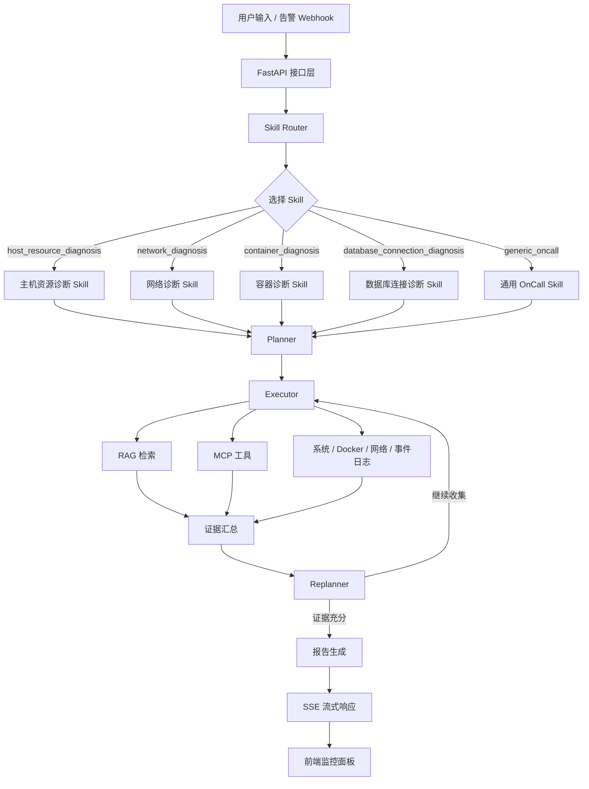

# 多智能体智能运维诊断平台

面向 OnCall / SRE 场景的多智能体智能运维诊断系统。项目围绕告警、故障现象和运维问答构建，支持 Skill 路由、诊断计划生成、只读工具调用、RAG 知识库检索、SSE 流式过程展示、Markdown 诊断报告、AgentOps 运行记录、EvalOps 离线评估、指标监控和本地演示控制台。

项目核心基于 `FastAPI`、`LangGraph`、`LangChain`、`Milvus`、`Redis`、`MCP / FastMCP`、DashScope/Qwen 兼容模型和可选本地模型运行。依赖版本以 `requirements.txt`、`open-webSearch-main/package.json` 和锁文件为准。

## 核心能力

- **Skill 优先诊断**：先根据故障输入选择合适 Skill，再使用对应 Playbook 生成诊断计划，减少无关上下文和无关工具。
- **计划-执行-复盘闭环**：通过 `SkillRouter -> Planner -> Executor -> Replanner -> Report` 流程完成诊断，证据不足时继续收集或调整计划。
- **RAG 知识库**：使用 DashScope Embedding + Milvus 管理内置 OnCall SOP、Prometheus 告警语料和用户上传文档。
- **混合检索与精排**：支持 BM25 + Vector 融合召回和 DashScope rerank；组件不可用时自动降级。
- **MCP 工具接入**：接入本机系统、联网搜索、Windows 事件日志、网络诊断和 Docker 诊断工具。
- **工具权限边界**：通过 Skill 白名单、工具风险元数据和 `PERMISSION_MODE` 控制工具调用；高风险操作默认禁用。
- **RAG Chat**：提供独立知识库问答接口，支持会话记忆、多轮改写、摘要压缩、MCP 工具增强和受控联网搜索。
- **流式可观测输出**：前端实时展示 Skill 选择、诊断计划、步骤执行、工具调用、token/耗时统计、预算提示和最终报告。
- **AgentOps / EvalOps**：记录诊断运行、管理演示场景和评测用例，支持真实 SSE 录制回放、离线评估和结果留存。
- **工程化验证**：提供 pytest 测试、Prometheus 风格指标、可选 Redis/内存缓存和 GitHub Actions CI。

## 架构概览



核心链路保持 Skill 优先的诊断闭环：

1. 用户输入故障描述，或由 Alertmanager 告警回调推送告警。
2. Skill 路由器选择最匹配的诊断 Skill。
3. 规划器基于 Skill Playbook 生成诊断步骤。
4. 执行器调用 RAG 和允许的 MCP 工具收集证据。
5. 复盘器判断继续执行、调整计划、切换 Skill 或收敛输出。
6. 报告节点生成结构化 Markdown 诊断报告，并通过 SSE 返回前端。

AgentOps / EvalOps 是围绕主诊断链路增加的旁路能力：运行记录、场景管理、评测用例、离线回放、评估结果和指标展示都不替换原有 LangGraph 诊断流程。

## 当前 Skill

| Skill | 适用场景 | 风险级别 |
|---|---|---|
| `host_resource_diagnosis` | 本机 CPU、内存、磁盘、进程和 Windows 日志排查 | 低 |
| `network_diagnosis` | DNS、Ping、HTTP、端口连通性和网络超时排查 | 低 |
| `container_diagnosis` | Docker 容器状态、资源、日志和 inspect 诊断 | 中 |
| `database_connection_diagnosis` | MySQL、PostgreSQL、Redis 等连接超时、拒绝、DNS/端口问题 | 低 |
| `generic_oncall` | 通用 OnCall 排障兜底路径 | 低 |

## 控制台功能

前端页面已整理为模块化结构，入口为 `frontend/index.html`，脚本位于 `frontend/js/`，样式位于 `frontend/styles/`。

| 区域 | 功能 |
|---|---|
| AIOps 诊断 | 输入故障、启动诊断、查看 SSE 步骤流、工具调用、token 统计和最终报告 |
| RAG 聊天 | 基于知识库进行问答，可选联网搜索和工具增强 |
| 知识库 | 上传、查看和删除知识库文档 |
| AgentOps 控制台 | 查看运行概览、诊断历史、报告、场景库、评测用例和评测结果 |
| 离线录制文件 | 使用审核后的真实 SSE 录制文件进行回放和离线评估 |
| 指标与告警 | 查看 `/metrics` 指标和 Alertmanager 告警回调历史 |

RAG Chat 已支持模型或工具执行失败时的降级收尾：接口会返回降级进度、可展示回答和统计信息，避免前端把整条检索流程判定为硬中断。

## AgentOps 与 EvalOps

AgentOps 采用本地 SQLite / SQLAlchemy 持久化诊断运行、演示场景、评测用例和评测结果。相关接口挂载在 `/api/v1/agentops/*`，可供前端控制台查询和维护本地演示数据。

EvalOps 通过 `scripts/run_agent_eval.py` 读取 `frontend/demo_fixtures/manifest.json` 中登记的真实录制文件。仓库默认不提交真实运行数据；没有样本时会生成 `sample_size = 0` 的报告，用于验证评估链路、报告格式和结果入库流程，不伪造评估数据。

常用验证命令：

```powershell
python scripts\run_agent_eval.py --mode offline
pytest -q
python -m compileall -q app mcp_servers scripts
python scripts\validate_skill.py
```

## 技术栈

技术栈只列核心组成，具体版本以依赖文件为准。

| 层级 | 主要技术 | 作用 |
|---|---|---|
| 接口与流式通信 | FastAPI、Uvicorn、sse-starlette | HTTP API、静态前端挂载、SSE 诊断流和 RAG Chat 流 |
| 诊断编排 | LangGraph、LangChain、Pydantic | Skill 路由、计划生成、工具绑定、状态流转和模型输入输出校验 |
| 模型与检索 | DashScope/Qwen、Milvus、BM25、RRF、rerank、Redis | 对话生成、向量检索、混合召回、精排和会话记忆 |
| 工具系统 | MCP / FastMCP、psutil、httpx、open-webSearch | 本机诊断、网络诊断、Docker 诊断、事件日志和受控联网搜索 |
| 数据与观测 | SQLite、SQLAlchemy、Prometheus 风格指标、可选 Redis 缓存 | AgentOps 记录、评估结果、运行指标和低风险缓存 |
| 前端与工程 | HTML、CSS、原生 JavaScript、Docker Compose、pytest、GitHub Actions | 本地控制台、容器化依赖、回归测试和 CI 检查 |

## 快速开始

### 1. 克隆项目

```powershell
git clone <your-repo-url>
cd multi-rag-agent
```

### 2. 创建 Python 环境

```powershell
python -m venv .venv
.\.venv\Scripts\Activate.ps1
pip install -r requirements.txt
```

### 3. 配置环境变量

```powershell
copy .env.example .env
notepad .env
```

至少需要配置：

```env
DASHSCOPE_API_KEY=your-dashscope-api-key
KB_ADMIN_TOKEN=change-this-admin-token
```

常用配置：

```env
WEB_SEARCH_PROVIDER=open_websearch
OPEN_WEBSEARCH_BASE_URL=http://127.0.0.1:3210
RAG_HYBRID_ENABLED=true
RAG_RERANK_ENABLED=true
PERMISSION_MODE=normal
DOCKER_ALLOW_RESTART=false
```

如需本地模型兜底，可启用：

```env
LOCAL_LLM_ENABLED=true
LOCAL_LLM_BASE_URL=http://localhost:11434/v1
LOCAL_LLM_MODEL=qwen2.5:7b
```

### 4. 启动基础依赖

```powershell
docker compose up -d
```

该命令会启动 Milvus、etcd、MinIO、Attu、Redis 和 open-webSearch。

### 5. 导入知识库

先检查切分结果，不写入 Milvus：

```powershell
python scripts\ingest_kb_corpus.py --dry-run
```

确认无误后写入 Milvus：

```powershell
python scripts\ingest_kb_corpus.py --reset
```

如需重新生成 Prometheus 告警语料：

```powershell
powershell -ExecutionPolicy Bypass -File scripts\fetch_kb_corpus.ps1
python scripts\convert_prometheus_alerts.py
```

### 6. 启动应用

```powershell
powershell -NoProfile -ExecutionPolicy Bypass -File .\run.ps1
```

默认服务地址：

```text
主应用             http://localhost:9900
系统工具服务       http://localhost:8005/mcp
联网搜索工具服务   http://localhost:8006/mcp
事件日志工具服务   http://localhost:8008/mcp
网络诊断工具服务   http://localhost:8009/mcp
Docker 工具服务    http://localhost:8011/mcp
本地搜索服务       http://127.0.0.1:3210
```

停止服务：

```powershell
powershell -NoProfile -ExecutionPolicy Bypass -File .\run.ps1 -Stop
```

## 访问地址

| 页面 | 地址 |
|---|---|
| 前端控制台 | http://localhost:9900 |
| 接口文档 | http://localhost:9900/docs |
| 备用接口文档 | http://localhost:9900/redoc |
| 健康检查 | http://localhost:9900/api/v1/health |
| 就绪检查 | http://localhost:9900/api/v1/health/ready |
| Milvus 管理页面 | http://localhost:8000 |
| 运行指标 | http://localhost:9900/metrics |

## 使用示例

### 本机资源诊断

```text
我电脑很卡，帮我看下是不是 CPU 或内存太高
```

可观察 `skill_selected`、`plan`、`tool_call`、`usage`、`report` 等 SSE 事件。实际 Skill 选择以运行时事件为准。

### 数据库连接诊断

```text
Redis 实例 redis-master-01 连接超时，应用日志提示 connection pool exhausted
```

系统会优先收集 DNS、端口、HTTP 和知识库证据，不请求或使用数据库账号、密码、DSN 等敏感信息。

### 告警 Webhook 模拟

```powershell
python scripts\mock_alert.py --scenario redis
python scripts\mock_alert.py --list-history
```

## API 概览

| 功能 | 方法 | 路径 |
|---|---|---|
| AIOps 诊断，SSE | POST | `/api/v1/aiops/diagnose` |
| 告警 Webhook | POST | `/api/v1/webhook/alertmanager` |
| RAG Chat，SSE | POST | `/api/v1/chat/stream` |
| RAG Chat 历史 | GET | `/api/v1/chat/sessions/{session_id}/history` |
| 清空 RAG Chat 会话 | DELETE | `/api/v1/chat/sessions/{session_id}` |
| Skill 列表 | GET | `/api/v1/skills` |
| 上传文档 | POST | `/api/v1/documents/upload` |
| 文档列表 | GET | `/api/v1/documents` |
| 删除文档 | DELETE | `/api/v1/documents/{source}` |
| AgentOps 概览 | GET | `/api/v1/agentops/summary` |
| AgentOps 运行历史 | GET | `/api/v1/agentops/runs` |
| AgentOps 场景库 | GET/POST/PUT/DELETE | `/api/v1/agentops/scenarios` |
| EvalOps 用例 | GET/POST/PUT/DELETE | `/api/v1/agentops/eval-cases` |
| EvalOps 结果 | GET | `/api/v1/agentops/eval-results` |
| 健康检查 | GET | `/api/v1/health` |
| 就绪检查 | GET | `/api/v1/health/ready` |

知识库上传和删除需要请求头：

```http
X-KB-Admin-Token: your-admin-token
```

## 配置要点

| 配置 | 默认值 | 说明 |
|---|---|---|
| `AGENT_MAX_STEPS` | `5` | 单次诊断最大步骤数 |
| `AGENT_MAX_REROUTES` | `1` | Replanner 允许切换 Skill 的最大次数 |
| `EXECUTOR_PARALLEL_ENABLED` | `true` | 是否启用只读工具并行执行 |
| `EXECUTOR_MAX_PARALLEL` | `6` | 单批并行工具上限 |
| `RAG_TOP_K` | `3` | 最终送入回答的文档数量 |
| `RAG_RETRIEVE_K` | `20` | 精排前候选数量 |
| `RAG_HYBRID_ENABLED` | `true` | 是否启用 BM25 + Vector 融合 |
| `RAG_RERANK_ENABLED` | `true` | 是否启用精排 |
| `RAG_CHAT_MEMORY_ENABLED` | `false` | 是否启用 Redis 会话记忆 |
| `RAG_CHAT_WEB_SEARCH_ENABLED` | `false` | RAG Chat 是否允许受控联网搜索 |
| `PERMISSION_MODE` | `normal` | 工具权限模式 |
| `DOCKER_ALLOW_RESTART` | `false` | 是否允许 Docker restart 高风险工具 |
| `HARNESS_MAX_TOTAL_TOKENS` | `0` | 单次运行 token 硬上限，0 表示不限制 |
| `HARNESS_MAX_TOTAL_MS` | `0` | 单次运行耗时硬上限，0 表示不限制 |

## 性能与评估数据

项目内置基准测试和 RAG 离线评估脚本，覆盖 token 开销、工具执行延迟和 RAG 检索准确率。当前 README 保留原评估口径和量化结果，便于展示优化前后的收益。

| 指标 | 结果 |
|---|---|
| Planner 输入 tokens | `9098 -> 575`，下降 93.5% |
| 全链路输入 tokens | `10526 -> 2450`，下降 76.7% |
| 全链路总 tokens | `11889 -> 3988`，下降 66.5% |
| 工具目录输入 tokens | 下降 55.3% |
| 只读工具并行执行 | `1.06s -> 0.22s`，加速 4.88x，延迟下降 79.5% |
| RAG 文档规模 | 954 个文档 / 4080 个 chunks |
| RAG R@1 | `83.33% -> 91.67%` |
| RAG MRR | `0.882 -> 0.938` |
| 默认 `top_k=3` R@3 | 95.83% |

说明：

- Token 数据来自真实模型服务返回的 `usage` 字段。
- 并行工具数据来自 5 个独立只读工具的受控基准测试。
- RAG 数据来自 24 题黄金集和 954 文档规模的离线评估。
- 混合检索在当前语料下虽然能提升 R@3/R@5，但 R@1 会下降，因此默认仍采用纯向量 `top_k=3`。

## 文档索引

| 文档 | 内容 |
|---|---|
| `docs/portfolio/facts.md` | 本地环境、Skill、RAG/Search 配置、MCP 端口与知识库检查结果 |
| `docs/portfolio/benchmark_local.md` | 本地基准测试与评估可复现性检查记录 |
| `docs/portfolio/dep_audit.md` | Python 与 Node 依赖审计记录 |
| `docs/portfolio/sse_contract.md` | AIOps SSE 事件契约 |
| `docs/portfolio/smoke_check.md` | 演示前只读检查说明 |
| `docs/portfolio/agentops_architecture.md` | AgentOps / EvalOps 增量架构与边界 |
| `docs/portfolio/release_notes.md` | 版本更新、前端重构、AgentOps / EvalOps、验证、演示与来源说明 |

## 项目结构

```text
multi-rag-agent/
├── app/                    # FastAPI / Agent / RAG / Skill 核心代码
│   ├── agents/             # LangGraph 节点与 Agent 流程
│   ├── api/                # 接口路由
│   ├── core/               # 模型、Embedding、Milvus、RAG、联网搜索、缓存和指标
│   ├── runtime/            # 运行时控制、权限、工具过滤和并行工具执行
│   ├── services/           # AIOps、RAG Chat、文档服务
│   └── skills/             # Skill 定义、加载和注册
├── mcp_servers/            # MCP 工具服务
├── frontend/               # 前端控制台
│   ├── js/                 # 核心工具和业务模块
│   └── styles/             # 样式令牌、基础样式和组件样式
├── docs/sop/               # 内置 OnCall SOP
├── docs/portfolio/         # 本地事实、架构、SSE、验证和版本说明
├── data/kb_corpus/         # RAG 知识库语料
├── scripts/                # 知识库、语料转换、告警模拟和验证脚本
├── open-webSearch-main/    # 本地联网搜索服务
├── docker-compose.yml      # Milvus + etcd + MinIO + Attu + Redis + open-webSearch
├── requirements.txt
├── .env.example
└── run.ps1                 # Windows 一键启动脚本
```

## 许可与第三方说明

本项目代码按 **MIT License** 口径维护。仓库中集成或参考的第三方开源资产请遵守各自许可和署名要求：

- **Aas-ee/open-webSearch**：本地联网搜索服务，仓库副本位于 `open-webSearch-main/`，其本地许可证文件为 Apache License 2.0。
- **samber/awesome-prometheus-alerts**：Prometheus 告警语料来源，仓库副本位于 `data/kb_corpus/awesome-prometheus-alerts/`，原始内容遵循 CC BY 4.0。
- **Kkkirito-123/mutil-rag-agent**：本仓库早期工程基础参考来源之一；相关来源说明可参考 `docs/portfolio/release_notes.md`。
- **小林 OnCall Agent 项目**：OnCall Agent 场景、诊断流程和表达方式的参考来源之一。

公开发布、二次分发或用于展示时，请保留必要的第三方署名、许可文件和来源说明。
